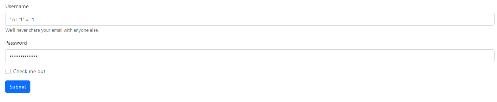

# 18.Gün - 27.09.2022

## Öğrenilen kavramlar

- htmlspecialchars
- strip_tags
- trim
- ltrim
- rtrim

Login kontrol sayfasında gerekli ayarları yaptıktan sonra yukarıdaki resimde username inputunda gözüken karakterleri giriyoruz,şifre olarak da aynı karakterler giriliyor. Sonuç olarak login işlemi başarılı oluyor. Bu da bir güvenlik açığı yaratıyor. Bizim bu inputdaki değeri gerekli fonksiyonlara sokup öyle database ile karşılaştırmamız lazım lazım.