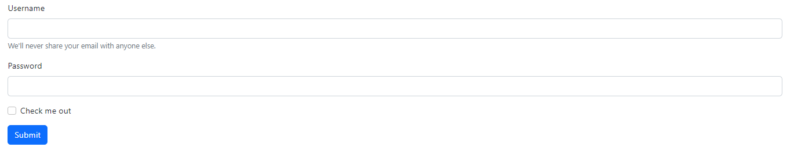

# adminPanelWithCurlAndSessionAndCookies

## Yapılanlar

1- Login sayfasında giriş işlemi yapılıyor.
2- Eğer Yetki durumu 1 ise admin panele 0 ise letgodan çektiğimiz verilerle oluşturduğumuz siteye gidiyor.
3- Admin panelde her kullanıcın kullanıcı adını, şifresini,indirim oranın ve yetki seviyesini güncellenebiliyor.
4- Letgo sayfasında çekilen ürünlerin fiyatları kullanıcın indirim oranıyla ilişkili olarak görüntüleniyor.

### Resimler

